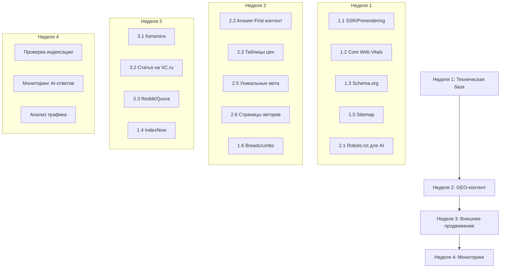

# План SEO + GEO для CODEXAI

> **Инструкция для нейросети:** Выполняй задачи строго по порядку. Каждая задача содержит: контекст, конкретные файлы для изменений, примеры кода и критерии завершения.

---

## Часть 1: SEO — Техническая база

### Задача 1.1: SSR/Prerendering (КРИТИЧНО)

**Контекст:** Сайт — SPA на React. Боты (включая GPTBot) не видят контент без SSR.

**Действия:**
1. Установить `vite-plugin-ssr` или настроить prerender.io
2. Добавить middleware в [server.js](file:///Users/nikitagusev/Downloads/codexai-last-main/server.js) для определения ботов
3. Генерировать статический HTML для всех страниц из sitemap

**Файлы:**
- [NEW] `prerender.config.js`
- [MODIFY] `server.js` — добавить bot detection middleware
- [MODIFY] `vite.config.ts` — подключить SSR-плагин

**Критерий:** `curl -A "Googlebot" https://codexai.pro/` возвращает полный HTML с контентом.

---

### Задача 1.2: Core Web Vitals

**Целевые метрики:**
| Метрика | Цель |
|---------|------|
| LCP | < 2.5s |
| INP | < 200ms |
| CLS | < 0.1 |

**Действия:**
1. В [index.html](file:///Users/nikitagusev/Downloads/codexai-last-main/index.html):
   - Добавить `<link rel="preload">` для шрифтов Space Grotesk и Cinzel
   - Добавить `<link rel="preconnect">` для CDN
2. В [Hero.tsx](file:///Users/nikitagusev/Downloads/codexai-last-main/components/Hero.tsx):
   - Уменьшить `particlesCount` с 1800 до 800 на desktop
   - Добавить `will-change: transform` для canvas
3. В [Image.tsx](file:///Users/nikitagusev/Downloads/codexai-last-main/components/Image.tsx):
   - Добавить `loading="lazy"` и `decoding="async"`

**Пример для index.html:**
```html
<link rel="preload" href="https://fonts.googleapis.com/css2?family=Space+Grotesk:wght@400;700&display=swap" as="style">
<link rel="preconnect" href="https://aistudiocdn.com" crossorigin>
```

---

### Задача 1.3: Расширенная Schema.org

**Текущее:** Базовые Organization, WebSite, ProfessionalService.

**Добавить в [SEO.tsx](file:///Users/nikitagusev/Downloads/codexai-last-main/components/SEO.tsx):**

```typescript
// 1. Person schema для авторов (E-E-A-T)
{
  "@type": "Person",
  "@id": "https://codexai.pro/#founder",
  "name": "Имя Фаундера",
  "jobTitle": "CEO & Founder",
  "sameAs": [
    "https://linkedin.com/in/founder",
    "https://t.me/founder"
  ]
}

// 2. Entity Linking через sameAs
// В существующий Organization добавить:
"sameAs": [
  "https://vc.ru/u/codexai",
  "https://clutch.co/profile/codexai",
  "https://www.linkedin.com/company/codexai"
]

// 3. FAQPage schema (отдельная функция)
const generateFAQSchema = (faqs: {question: string, answer: string}[]) => ({
  "@type": "FAQPage",
  "mainEntity": faqs.map(faq => ({
    "@type": "Question",
    "name": faq.question,
    "acceptedAnswer": {
      "@type": "Answer",
      "text": faq.answer
    }
  }))
});
```

---

### Задача 1.4: IndexNow

**Действия:**
1. Получить API-ключ IndexNow
2. Создать файл подтверждения

**Файлы:**
- [NEW] `public/{api-key}.txt` — файл верификации
- [MODIFY] [server.js](file:///Users/nikitagusev/Downloads/codexai-last-main/server.js) — endpoint для пинга IndexNow

**Пример кода для server.js:**
```javascript
const INDEXNOW_KEY = process.env.INDEXNOW_KEY;

async function pingIndexNow(urls) {
  await fetch('https://api.indexnow.org/indexnow', {
    method: 'POST',
    headers: { 'Content-Type': 'application/json' },
    body: JSON.stringify({
      host: 'codexai.pro',
      key: INDEXNOW_KEY,
      urlList: urls
    })
  });
}
```

---

### Задача 1.5: Sitemap с metadata

**Обновить [sitemap.xml](file:///Users/nikitagusev/Downloads/codexai-last-main/public/sitemap.xml):**

```xml
<?xml version="1.0" encoding="UTF-8"?>
<urlset xmlns="http://www.sitemaps.org/schemas/sitemap/0.9">
  <url>
    <loc>https://codexai.pro/</loc>
    <lastmod>2026-01-24</lastmod>
    <changefreq>weekly</changefreq>
    <priority>1.0</priority>
  </url>
  <url>
    <loc>https://codexai.pro/services/web</loc>
    <lastmod>2026-01-24</lastmod>
    <changefreq>monthly</changefreq>
    <priority>0.9</priority>
  </url>
  <!-- Аналогично для всех страниц -->
</urlset>
```

---

### Задача 1.6: Topical Authority — Hub & Spoke

**Структура:**
```
/services (Hub - Pillar Page)
├── /services/web (Spoke)
├── /services/bots (Spoke)
├── /services/ai (Spoke)
└── /services/tma (Spoke)
```

**Действия в [ServicesPage.tsx](file:///Users/nikitagusev/Downloads/codexai-last-main/components/ServicesPage.tsx):**
1. Добавить секцию "Связанные услуги" с внутренними ссылками
2. Использовать keyword-rich анкоры: "разработка Telegram-ботов" вместо "подробнее"

**Добавить компонент Breadcrumbs:**
```tsx
// components/Breadcrumbs.tsx
const breadcrumbSchema = {
  "@type": "BreadcrumbList",
  "itemListElement": items.map((item, i) => ({
    "@type": "ListItem",
    "position": i + 1,
    "name": item.name,
    "item": item.url
  }))
};
```

---

## Часть 2: GEO — Оптимизация под ИИ

### Задача 2.1: Robots.txt для AI-ботов

**Обновить [robots.txt](file:///Users/nikitagusev/Downloads/codexai-last-main/public/robots.txt):**

```text
User-agent: *
Allow: /
Sitemap: https://codexai.pro/sitemap.xml

# AI Crawlers - явное разрешение
User-agent: GPTBot
Allow: /

User-agent: ChatGPT-User
Allow: /

User-agent: PerplexityBot
Allow: /

User-agent: ClaudeBot
Allow: /

User-agent: Google-Extended
Allow: /

User-agent: Applebot-Extended
Allow: /
```

---

### Задача 2.2: Answer-First контент

**Принцип:** Каждый H2/H3 заголовок должен начинаться с прямого ответа (40-60 слов).

**Пример для [FAQ.tsx](file:///Users/nikitagusev/Downloads/codexai-last-main/components/FAQ.tsx):**

```tsx
const faqs = [
  {
    question: "Сколько стоит разработка сайта под ключ?",
    answer: "Стоимость сайта в CODEXAI: лендинг от 100 000 ₽ (5-10 дней), корпоративный сайт от 250 000 ₽ (2-4 недели), интернет-магазин от 500 000 ₽. Цена включает дизайн, разработку, адаптив и 12 месяцев гарантии на код."
  },
  {
    question: "За сколько дней вы делаете сайт?",
    answer: "Сроки разработки: лендинг 5-10 рабочих дней, корпоративный сайт 2-4 недели, интернет-магазин 4-8 недель. Все сроки фиксируются в договоре с гарантией."
  },
  {
    question: "Как заказать сайт в CODEXAI?",
    answer: "Оставьте заявку на сайте или напишите в Telegram @codexai_pro. В течение 24 часов получите КП с ценой и сроками. Работаем по договору с предоплатой 50%."
  }
];
```

---

### Задача 2.3: Таблицы и списки (Scannability)

**Добавить в [ServicesPage.tsx](file:///Users/nikitagusev/Downloads/codexai-last-main/components/ServicesPage.tsx) таблицу сравнения:**

```tsx
const priceTable = `
| Услуга | Цена от | Сроки | Гарантия |
|--------|---------|-------|----------|
| Лендинг | 100 000 ₽ | 5-10 дней | 12 мес |
| Корпоративный сайт | 250 000 ₽ | 2-4 недели | 12 мес |
| Интернет-магазин | 500 000 ₽ | 4-8 недель | 12 мес |
| Telegram-бот | 50 000 ₽ | 3-7 дней | 6 мес |
| Telegram Mini App | 120 000 ₽ | 2-4 недели | 12 мес |
| AI-интеграция | 100 000 ₽ | 1-3 недели | 6 мес |
`;
```

---

### Задача 2.4: Статистика и цифры

**Добавить конкретные метрики в кейсы [Portfolio.tsx](file:///Users/nikitagusev/Downloads/codexai-last-main/components/Portfolio.tsx):**

```tsx
const cases = [
  {
    title: "Редизайн сайта стоматологии",
    stats: [
      { label: "Рост заявок", value: "+340%", period: "за 3 месяца" },
      { label: "Снижение bounce rate", value: "-45%", period: "за месяц" },
      { label: "Позиция по 'стоматология москва'", value: "Топ-5", period: "через 6 недель" }
    ]
  }
];
```

---

### Задача 2.5: Уникальные мета для каждой услуги

**Обновить getSeoData() в [App.tsx](file:///Users/nikitagusev/Downloads/codexai-last-main/App.tsx):**

```typescript
const servicesSeo: Record<string, {title: string, description: string}> = {
  '/services/web': {
    title: "Разработка сайтов под ключ от 100 000 ₽ — за 7-30 дней",
    description: "Создаем продающие сайты с гарантией 12 месяцев. Лендинги, корпоративные сайты, интернет-магазины. Фиксированные сроки в договоре."
  },
  '/services/bots': {
    title: "Telegram-боты для бизнеса от 50 000 ₽ — автоматизация продаж",
    description: "Разрабатываем Telegram-ботов для лидогенерации, поддержки клиентов и автоматизации. Интеграция с CRM, оплатой и AI."
  },
  '/services/ai': {
    title: "Интеграция ChatGPT и AI в бизнес — от 100 000 ₽",
    description: "Внедряем искусственный интеллект: чат-боты с GPT, автоматизация контента, AI-аналитика. Кастомные решения под задачи."
  },
  '/services/tma': {
    title: "Telegram Mini Apps разработка от 120 000 ₽",
    description: "Создаем Mini Apps для Telegram: магазины, сервисы, игры. Полная интеграция с Telegram Payments и TON."
  }
};
```

---

### Задача 2.6: Страницы авторов (E-E-A-T)

**Создать [NEW] `components/AuthorPage.tsx`:**

```tsx
interface Author {
  name: string;
  role: string;
  bio: string;
  experience: string[];
  social: { platform: string; url: string }[];
  photo: string;
}

// Schema для автора
const authorSchema = (author: Author) => ({
  "@type": "Person",
  "name": author.name,
  "jobTitle": author.role,
  "description": author.bio,
  "image": author.photo,
  "sameAs": author.social.map(s => s.url),
  "worksFor": {
    "@type": "Organization",
    "name": "CODEXAI"
  }
});
```

---

### Задача 2.7: Контекстно-независимые блоки

**Принцип:** Каждый раздел должен быть понятен в отрыве от страницы.

**Плохо:**
> "Как мы уже говорили выше, это важно..."

**Хорошо:**
> "Стоимость разработки сайта в CODEXAI зависит от типа проекта: лендинг стоит от 100 000 ₽, корпоративный сайт от 250 000 ₽."

---

## Часть 3: Внешние сигналы (Off-Site)

### Задача 3.1: Регистрация в каталогах

| Платформа | Приоритет | Действие |
|-----------|-----------|----------|
| Яндекс.Бизнес | 🔴 | Зарегистрировать организацию, добавить все услуги |
| Google Business Profile | 🔴 | Создать профиль с фото офиса/команды |
| 2ГИС | 🟠 | Добавить компанию с категориями |
| Clutch.co | 🟠 | Создать профиль, запросить отзывы у клиентов |
| VC.ru | 🟠 | Создать страницу компании |
| Zoon, Yell.ru | 🟡 | Базовые профили |

---

### Задача 3.2: Контент для AI-источников

**Публикации для цитирования:**

| Платформа | Заголовок статьи | Цель |
|-----------|------------------|------|
| VC.ru | "Сколько стоит сайт в 2026: реальные цены от студии" | Ценовые запросы |
| Habr | "Как мы внедрили GPT-4 в Telegram-бота для застройщика" | Технический авторитет |
| Spark.ru | "Кейс: +340% заявок после редизайна стоматологии" | Социальное доказательство |
| YouTube | "Процесс разработки сайта за 2 минуты" | Видео-контент для AI |

---

### Задача 3.3: Reddit и Quora (для Perplexity)

**Действия:**
1. Отвечать на вопросы о разработке сайтов на Reddit (r/webdev, r/Entrepreneur)
2. Создать ответы на Quora по релевантным вопросам
3. Упоминать CODEXAI как пример в контексте

---

## Порядок выполнения



---

## Чек-лист готовности

- [ ] SSR работает, боты видят контент
- [ ] Core Web Vitals в зеленой зоне
- [ ] Schema.org: Organization, FAQPage, Person, BreadcrumbList
- [ ] Robots.txt разрешает AI-ботов
- [ ] Sitemap с lastmod и priority
- [ ] Уникальные meta для каждой страницы услуг
- [ ] FAQ с Answer-First структурой
- [ ] Таблица цен на сайте
- [ ] Страницы авторов с E-E-A-T
- [ ] Профили в Яндекс.Бизнес и Google Business
- [ ] Статья на VC.ru опубликована
- [ ] IndexNow настроен

---

> [!IMPORTANT]
> **Без SSR/Prerendering все остальные оптимизации бесполезны.** Начинай строго с задачи 1.1.
